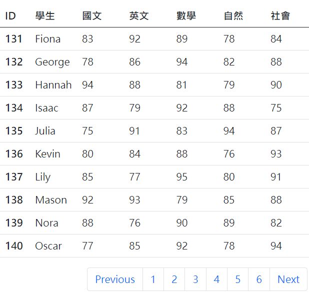

##### 1. Spring 官方文件 <https://docs.spring.io/spring-framework/reference/web/webmvc.html>

##### 2. Spring 官方文件- Spring Web MVC - Method Arguments: <https://docs.spring.io/spring-framework/reference/web/webmvc/mvc-controller/ann-methods/arguments.html>

##### 3. 如何增加 Swagger 文件

(1) pom.xml

```
<!-- Swagger -->
<dependency>
    <groupId>io.springfox</groupId>
    <artifactId>springfox-swagger2</artifactId>
    <version>2.5.0</version>
</dependency>
<dependency>
    <groupId>io.springfox</groupId>
    <artifactId>springfox-swagger-ui</artifactId>
    <version>2.5.0</version>
</dependency>
```

(2) 新增 SwaggerConfig.java

```
import org.springframework.context.annotation.Bean;
import org.springframework.context.annotation.ComponentScan;
import org.springframework.context.annotation.Configuration;
import org.springframework.web.servlet.config.annotation.EnableWebMvc;
import org.springframework.web.servlet.config.annotation.ResourceHandlerRegistry;
import org.springframework.web.servlet.config.annotation.WebMvcConfigurerAdapter;

import springfox.documentation.builders.PathSelectors;
import springfox.documentation.builders.RequestHandlerSelectors;
import springfox.documentation.service.ApiInfo;
import springfox.documentation.service.Contact;
import springfox.documentation.spi.DocumentationType;
import springfox.documentation.spring.web.plugins.Docket;
import springfox.documentation.swagger2.annotations.EnableSwagger2;

/**
 * http://localhost:8080/ServletToSpring/mvc/swagger-ui.html
 */
@Configuration
@EnableSwagger2
@EnableWebMvc
@ComponentScan(basePackages = "com.example")
public class SwaggerConfig extends WebMvcConfigurerAdapter {

	@Bean
	public Docket api() {
		return new Docket(DocumentationType.SWAGGER_2)
				.select()
				.apis(RequestHandlerSelectors.any())
				.paths(PathSelectors.any())
				.build()
				.apiInfo(apiInfo());
	}

	private ApiInfo apiInfo() {
		return new ApiInfo(
				"Rest API", 
				"Rest API Example", 
				"1", 
				"",
				new Contact("Aweit", "http://edwin.baculsoft.con", "edwin@baculsoft.com"), "Apache License", "");
	}

	@Override
	public void addResourceHandlers(ResourceHandlerRegistry registry) {
		registry.addResourceHandler("swagger-ui.html").addResourceLocations("classpath:/META-INF/resources/");
		registry.addResourceHandler("/webjars/**").addResourceLocations("classpath:/META-INF/resources/webjars/");
	}
}
```

(3) 重啟Tomcat，並輸入

```
http://localhost:8080/{專案名稱}/mvc/swagger-ui.html
```


##### 4. 如何利用JdbcTemplate實現表格分頁功能

(1) pom.xml

```
<!-- spring data jpa -->
<dependency>
    <groupId>org.springframework.boot</groupId>
    <artifactId>spring-boot-starter-data-jpa</artifactId>
    <version>2.6.7</version>
</dependency>
```

(2) 執行 dao 下的 score.sql

(3) dao 的關鍵代碼？

```
@Repository
public class ScoreDaoImpl implements ScoreDao {

	@Autowired
	JdbcTemplate jdbcTemplate;
	
	/**
	 * Pageable: getPageSize 每頁顯示幾筆？ getOffset 移動到第幾筆開始計算
	 */
	@Override
	public List<Score> findScoresByPage(Pageable page) {
		String sql = "SELECT studentId, studentName, chinese, english, math, science, social FROM web.score Limit ? Offset ?";
		return jdbcTemplate.query(sql, new BeanPropertyRowMapper<>(Score.class), page.getPageSize(),page.getOffset());
	}

	/**
	 * 取得總頁數。例如：51筆資料，如果每頁顯示10筆，則共有6頁。
	 */
	@Override
	public int totalPage(int pageSize) {
		String sql = "SELECT CEIL(COUNT(1) / ?) AS total FROM score;";
		return jdbcTemplate.queryForObject(sql, Integer.class,pageSize);
	}

}
```

(4) Controller 關鍵代碼：

```
@Controller
@RequestMapping("/score")
public class ScoreController {

	@Autowired
	ScoreDao scoreDao;
	
	@GetMapping
	public String socrePage(Model model, 
			@RequestParam(value = "currentPage", required = false, defaultValue = "1") Integer currentPage) {
		
		int totalPage = scoreDao.totalPage(10); // 算出總頁數
		
		Pageable page = PageRequest.of((currentPage-1), 10); // 0:第一頁(1-1=0) 10:每頁幾筆
		List<Score> scores = scoreDao.findScoresByPage(page);
		
		model.addAttribute("currentPage", currentPage);
		model.addAttribute("totalPage", totalPage);
		model.addAttribute("scores", scores);
		
		return "score_list";
	}
}
```

(5) JSP 關鍵代碼？

```
<%@ page language="java" contentType="text/html; charset=UTF-8"
    pageEncoding="UTF-8"%>
    
<%@ taglib uri="http://java.sun.com/jsp/jstl/core" prefix="c" %>

<link href="https://cdn.jsdelivr.net/npm/bootstrap@5.0.0/dist/css/bootstrap.min.css" rel="stylesheet">
<link rel="stylesheet" href="https://cdn.jsdelivr.net/npm/bootstrap-icons@1.11.1/font/bootstrap-icons.css">
<script src="https://cdn.jsdelivr.net/npm/bootstrap@5.0.0/dist/js/bootstrap.bundle.min.js"></script>
<script src="https://cdn.jsdelivr.net/npm/jquery@3.7.1/dist/jquery.min.js"></script>

<%-- ${ scores } --%>
<%-- ${ totalPage }--%>
<%-- ${ currentPage }--%>

<div class="d-flex flex-column" style="width:500px">
	<table class="table">
	  <thead>
	    <tr>
			<th scope="col" style="width: 50px;">ID</th>
	      	<th scope="col" style="width: 50px;">學生</th>
	      	<th scope="col" style="width: 100px;">國文</th>
	     	<th scope="col" style="width: 100px;">英文</th>
	      	<th scope="col" style="width: 100px;">數學</th>
	      	<th scope="col" style="width: 100px;">自然</th>
	      	<th scope="col" style="width: 100px;">社會</th>
	    </tr>
	  </thead>
	  <tbody>
	    <c:forEach items="${ scores }" var="score">
	    	<tr>
		      <th scope="row">${ score.studentId }</th>
		      <td>${ score.studentName }</td>
		      <td>${ score.chinese }</td>
		      <td>${ score.english }</td>
		      <td>${ score.math }</td>
		      <td>${ score.science }</td>
		      <td>${ score.social }</td>
		    </tr>
	    </c:forEach>
	  </tbody>
	</table>
	
	<nav class="d-flex justify-content-end me-2">
	  <ul class="pagination">
	    <li class="page-item"><a class="page-link" href="/ServletToSpring/mvc/score?currentPage=${ (currentPage - 1) <= 0 ? 1: currentPage - 1}">Previous</a></li>
	    <c:forEach begin="1" end="${ totalPage }" varStatus="loop">
	      <li class="page-item">
	      	<a class="page-link" href="/ServletToSpring/mvc/score?currentPage=${loop.index}">${loop.index}</a>
	      </li>
	    </c:forEach>
	    <li class="page-item"><a class="page-link" href="/ServletToSpring/mvc/score?currentPage=${ (currentPage + 1) >= totalPage ? totalPage: currentPage + 1  }">Next</a></li>
	  </ul>
	</nav>
</div>

```




