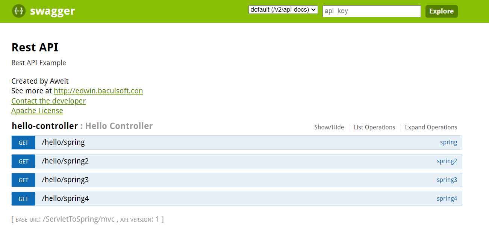

##### 1. Spring 官方文件 <https://docs.spring.io/spring-framework/reference/web/webmvc.html>

##### 2. Spring 官方文件- Spring Web MVC - Method Arguments: <https://docs.spring.io/spring-framework/reference/web/webmvc/mvc-controller/ann-methods/arguments.html>

##### 3. 如何增加 Swagger 文件

(1) pom.xml

```
<!-- Swagger -->
<dependency>
    <groupId>io.springfox</groupId>
    <artifactId>springfox-swagger2</artifactId>
    <version>2.5.0</version>
</dependency>
<dependency>
    <groupId>io.springfox</groupId>
    <artifactId>springfox-swagger-ui</artifactId>
    <version>2.5.0</version>
</dependency>
```

(2) 新增 SwaggerConfig.java

```
import org.springframework.context.annotation.Bean;
import org.springframework.context.annotation.ComponentScan;
import org.springframework.context.annotation.Configuration;
import org.springframework.web.servlet.config.annotation.EnableWebMvc;
import org.springframework.web.servlet.config.annotation.ResourceHandlerRegistry;
import org.springframework.web.servlet.config.annotation.WebMvcConfigurerAdapter;

import springfox.documentation.builders.PathSelectors;
import springfox.documentation.builders.RequestHandlerSelectors;
import springfox.documentation.service.ApiInfo;
import springfox.documentation.service.Contact;
import springfox.documentation.spi.DocumentationType;
import springfox.documentation.spring.web.plugins.Docket;
import springfox.documentation.swagger2.annotations.EnableSwagger2;

/**
 * http://localhost:8080/ServletToSpring/mvc/swagger-ui.html
 */
@Configuration
@EnableSwagger2
@EnableWebMvc
@ComponentScan(basePackages = "com.example")
public class SwaggerConfig extends WebMvcConfigurerAdapter {

	@Bean
	public Docket api() {
		return new Docket(DocumentationType.SWAGGER_2)
				.select()
				.apis(RequestHandlerSelectors.any())
				.paths(PathSelectors.any())
				.build()
				.apiInfo(apiInfo());
	}

	private ApiInfo apiInfo() {
		return new ApiInfo(
				"Rest API", 
				"Rest API Example", 
				"1", 
				"",
				new Contact("Aweit", "http://edwin.baculsoft.con", "edwin@baculsoft.com"), "Apache License", "");
	}

	@Override
	public void addResourceHandlers(ResourceHandlerRegistry registry) {
		registry.addResourceHandler("swagger-ui.html").addResourceLocations("classpath:/META-INF/resources/");
		registry.addResourceHandler("/webjars/**").addResourceLocations("classpath:/META-INF/resources/webjars/");
	}
}
```

(3) 重啟Tomcat，並輸入

```
http://localhost:8080/{專案名稱}/mvc/swagger-ui.html
```

