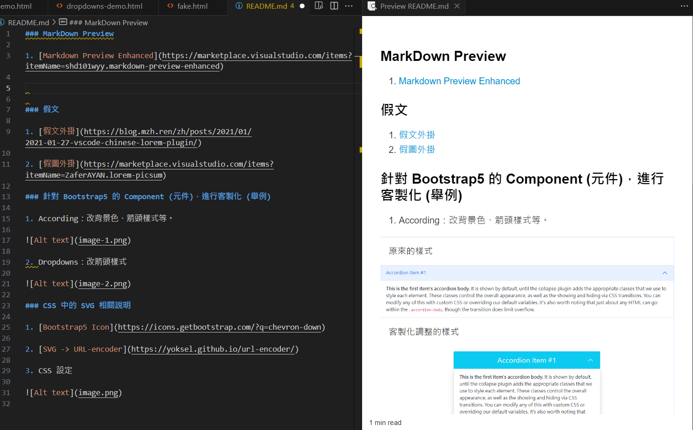
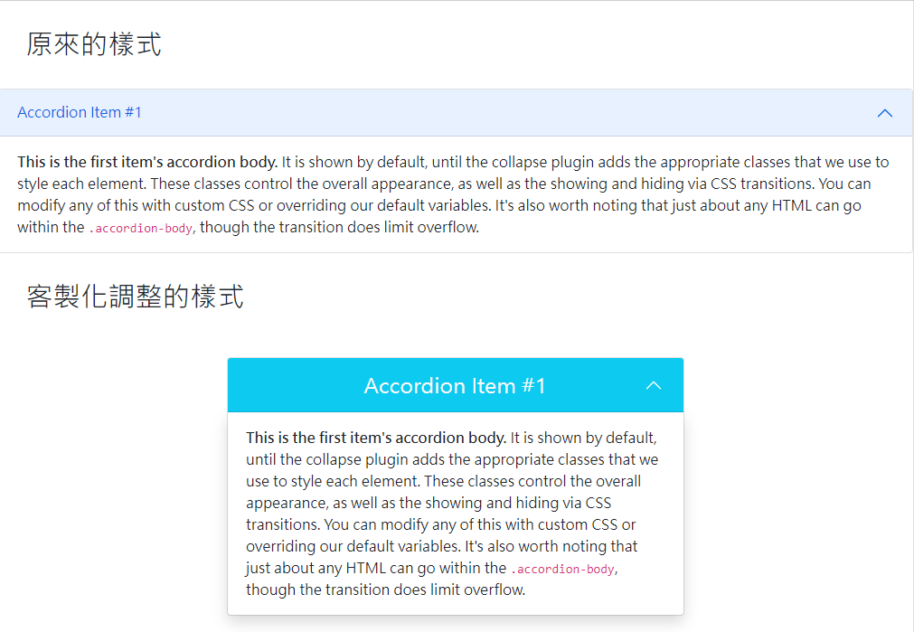
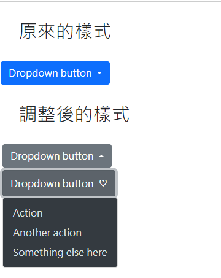
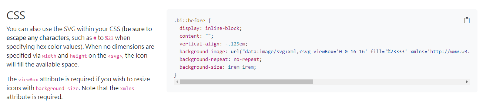

### MarkDown Preview

1. [Markdown Preview Enhanced](https://marketplace.visualstudio.com/items?itemName=shd101wyy.markdown-preview-enhanced)

### 假文

1. [假文外掛](https://blog.mzh.ren/zh/posts/2021/01/2021-01-27-vscode-chinese-lorem-plugin/)

    **關鍵字： jw <字符数>**

2. [假圖外掛](https://marketplace.visualstudio.com/items?itemName=ZaferAYAN.lorem-picsum)

    **關鍵字： picsum**

### 針對 Bootstrap5 的 Component (元件)，進行客製化 (舉例)

1. According：改背景色、箭頭樣式等。

2. Dropdowns：改箭頭樣式

### CSS 中的 SVG 相關說明

1. [Bootstrap5 Icon](https://icons.getbootstrap.com/?q=chevron-down)

2. [SVG -> URL-encoder](https://yoksel.github.io/url-encoder/)

3. CSS 設定

