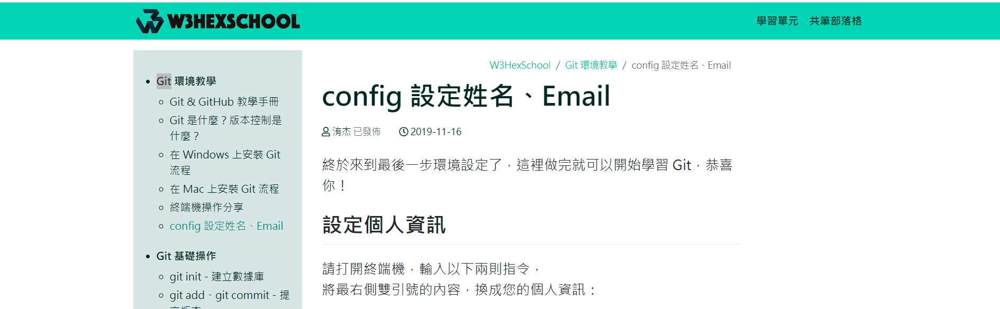

### Git 教學 [#Link](https://w3c.hexschool.com/git/8a39ab5)

#### 1. 在 Windows 上安裝 Git 流程 / 在 Mac 上安裝 Git 流程

* Windows: <https://w3c.hexschool.com/git/3f9497cd>

* Mac: <https://w3c.hexschool.com/git/fd6f6be>

#### 2. config 設定姓名、Email

* <https://w3c.hexschool.com/git/8a39ab5>

#### 3. git clone - 克隆遠端數據庫

     > git clone https://github.com/aweit-zhu/aweit-share.git

#### 4. git pull - 下載同步更新

* <https://w3c.hexschool.com/git/3a1a8767>

#### (未完待續....)