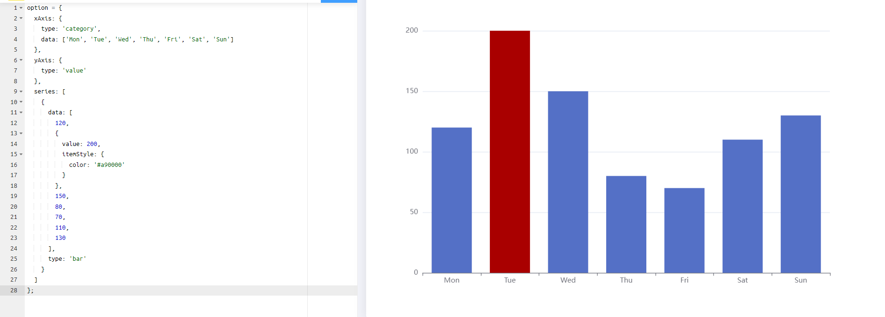
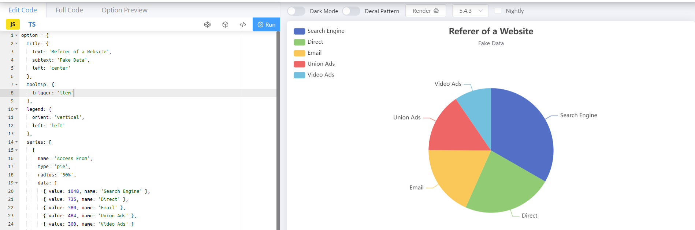
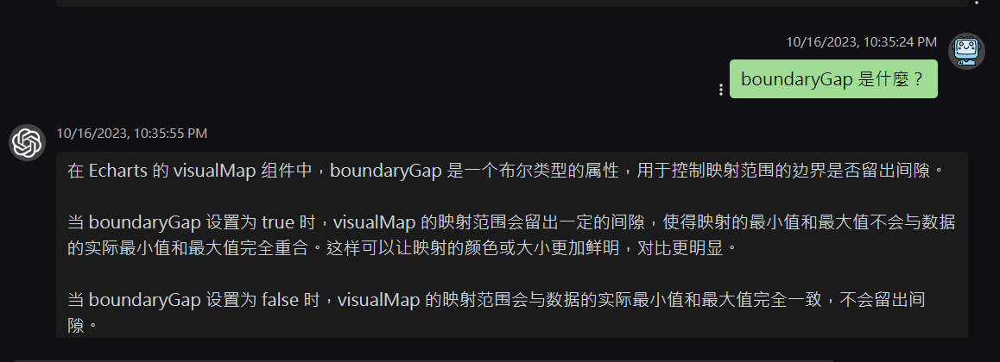

#### 1. Apache ECharts 官網連結 [#Link](https://echarts.apache.org/)

#### 2. Apache ECharts 範例 [#Link](https://echarts.apache.org/examples/zh/index.html#chart-type-pie)

#### 3. vscode extension for ECharts [#Link](https://marketplace.visualstudio.com/items?itemName=susiwen8.vscode-echarts-extension)

  > PS: From 0.1.2, extension won't provide completion at first, because JS file may not import ECharts. User need to execute echarts.activate at command panel.

---

#### 官網範例 (擷取)

* [带背景色的柱状图](https://echarts.apache.org/examples/zh/index.html#chart-type-bar)

* [分割数据到数个饼图](https://echarts.apache.org/examples/zh/editor.html?c=data-transform-multiple-pie)

* [柱状图排序](https://echarts.apache.org/examples/zh/editor.html?c=data-transform-sort-bar)

* [動態異步數據](https://echarts.apache.org/handbook/zh/how-to/data/dynamic-data)

* [Line Gradient](https://echarts.apache.org/examples/en/editor.html?c=line-gradient)

* [Stacked Line Chart](https://echarts.apache.org/examples/en/editor.html?c=line-stack)

---

#### 整理重點

1. 初始化

```
<script src="https://cdn.jsdelivr.net/npm/echarts@5.4.3/dist/echarts.min.js"></script>

<div id="main" style="width: 600px;height:400px;"></div>

<script type="text/javascript">
  var myChart = echarts.init(document.getElementById('main'));
</script>
```

2. 響應容易大小的變化

```
 window.addEventListener('resize', myChart.resize);
```

3. 顏色主題

```
var chart = echarts.init(dom, 'dark');  // 暗色系
```
4. itemStyle: 

    (1) [範例](https://echarts.apache.org/examples/zh/editor.html?c=bar-data-color)

    

    (2) [API](https://echarts.apache.org/en/option.html#series-bar.itemStyle)

5. legend：圖例位置

    

6. 高亮的樣式: emphasis


7. grid：網格(圖表的座標) (可以多個)，可以設定左、上、右、下的距離等。


####  問問看 [ChatGPT](https://chatgptlogin.ai/chat/) 應該可以得到更多清楚的說明

